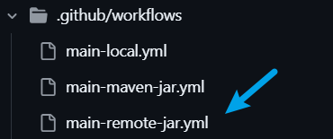
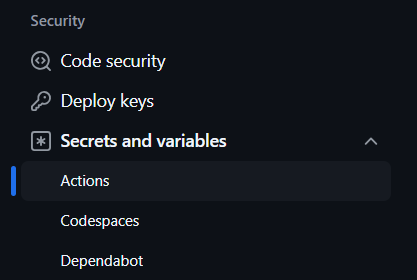
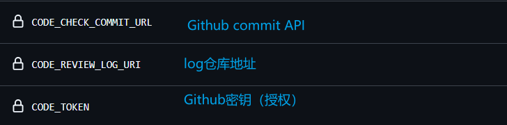
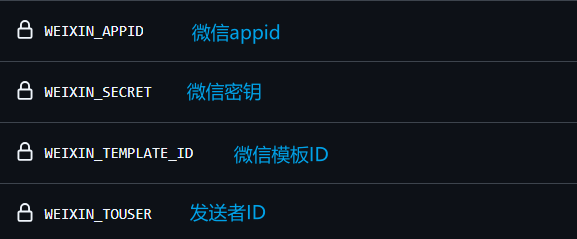
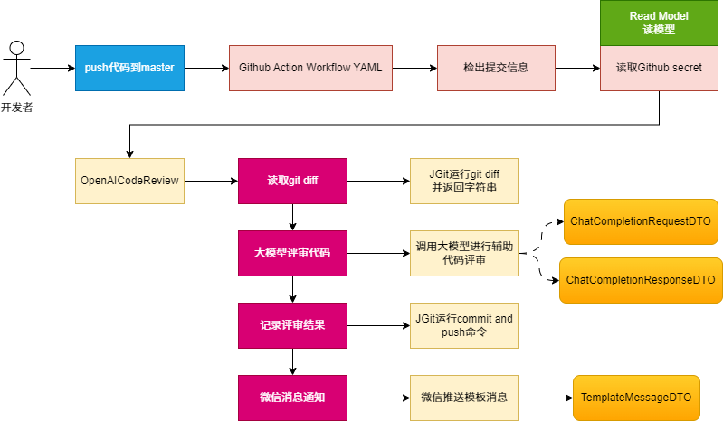

# `OpenAI` 自动审核代码组件

### 一、项目说明：

​		当开发者在提交合并分支的代码，则触发代码评审，并写入评审日志文件。完成后发送消息通知，点击<详情>查看评审细节。这样就可用方便知道本次开发的代码是否有问题啦。（该项目只能做辅助作用，而不能完全依赖该审核结果）

### 二、使用方法

1、复制本仓库`.github/workflows`文件夹下的`main-remote-jar.yml`到你的项目同位置目录下

2、配置仓库密钥

3、配置`commit url`、`log`仓库地址以及`Github`密钥

`commit url`格式：`https://api.github.com/repos/{owner}/{repo}/commits/`

- `owenr`：你的账户名称
- `repo`：使用该组件的项目仓库名称

4、配置项目编程语言（提高审核准确性）

5、配置大模型

[智谱大模型](https://open.bigmodel.cn/usercenter/apikeys)

6、配置消息通知

​	1、配置通知类型（根据自身需求选择，项目暂时只提供了飞书和微信两种消息通知方式）

​	2、微信公众号对接：`weixin`		

- [微信公众号配置](https://mp.weixin.qq.com/debug/cgi-bin/sandboxinfo?action=showinfo&t=sandbox/index)

​	3、飞书机器人对接：`feishu`

- [飞书机器人配置](https://open.feishu.cn/document/client-docs/bot-v3/add-custom-bot)

### 三、建模流程

