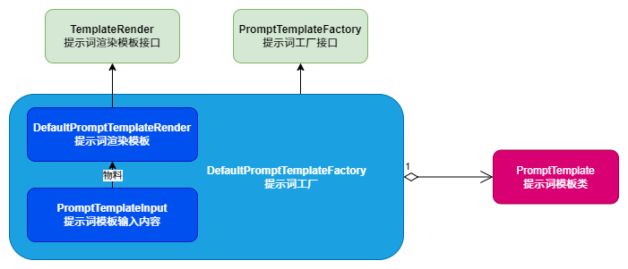

# `OpenAI` 自动审核代码组件

### 一、项目说明：

​		当开发者在提交合并分支的代码，则触发代码评审，并写入评审日志文件。完成后发送消息通知，点击<详情>查看评审细节。这样就可用方便知道本次开发的代码是否有问题啦。（该项目只能做辅助作用，而不能完全依赖该审核结果）

#### 提示词优化：



使用案例：

```java
PromptTemplate promptTemplate = PromptTemplate.from("你是一个{{language}}高级编程架构师，精通各类场景方案和架构设计，请你辅助用户评审代码。");
Map<String, Object> params = new HashMap<>();
params.put("language", getEnv("PROJECT_LANGUAGE"));
ChatCompletionRequestDTO.Prompt prompt = promptTemplate.apply(Role.SYSTEM, params);
```

使用提示词模板的好处：

1. **效率提升**：通过预设模板，可以快速应用相应的提示词，减少编写提示词的时间，自动化评审流程。
2. **标准化输出**：模板化提示词可以让AI的评审结果更加一致，减少因不同提示导致的评审质量不稳定。
3. **可扩展性**：提示词模板可以根据项目需求和AI能力不断扩展和优化，适应不同的代码风格和评审要求。
4. **降低学习曲线**：使用模板让没有AI深度经验的开发者也可以轻松上手AI代码评审，提高技术推广的便捷性。

### 二、使用方法

1、复制本仓库`.github/workflows`文件夹下的`main-remote-jar.yml`到你的项目同位置目录下


2、配置仓库密钥


3、配置`commit url`、`log`仓库地址以及`Github`密钥

`commit url`格式：`https://api.github.com/repos/{owner}/{repo}/commits/`

- `owenr`：你的账户名称
- `repo`：使用该组件的项目仓库名称


4、配置项目编程语言（提高审核准确性）


5、配置大模型（本项目目标对接 `ChatGLM` 以及 `DeepSeek`）

[智谱大模型](https://open.bigmodel.cn/usercenter/apikeys)


6、配置消息通知

​	1、配置通知类型（根据自身需求选择，项目暂时只提供了飞书和微信两种消息通知方式）


​	2、微信公众号对接：`weixin`		

- [微信公众号配置](https://mp.weixin.qq.com/debug/cgi-bin/sandboxinfo?action=showinfo&t=sandbox/index)


​	3、飞书机器人对接：`feishu`

- [飞书机器人配置](https://open.feishu.cn/document/client-docs/bot-v3/add-custom-bot)


### 三、建模流程

