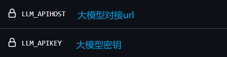
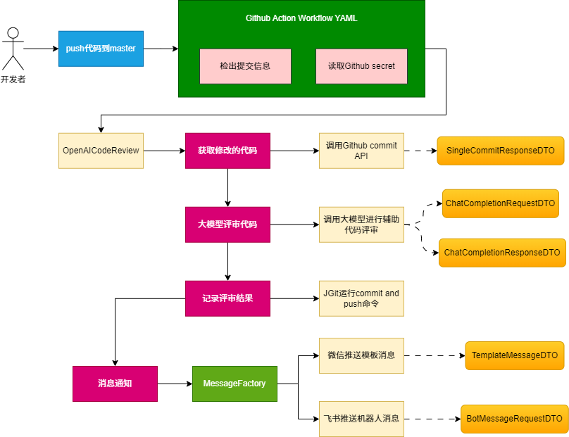

# `OpenAI` 辅助代码审核

### 一、项目说明：

​		当开发者在提交合并分支的代码，则触发代码评审，并写入评审日志文件。完成后发送公众号模板消息通知，点击<详情>查看评审细节。这样就可用方便知道本次开发的代码是否有问题啦。（该项目只能做辅助作用，而不能完全依赖该审核结果）

### 二、使用方法

1、配置仓库密钥

2、配置log日志的仓库地址以及token

3、配置大模型（https://open.bigmodel.cn/usercenter/apikeys）

4、对接微信消息通知（https://mp.weixin.qq.com/debug/cgi-bin/sandboxinfo?action=showinfo&t=sandbox/index）

### 三、建模流程

